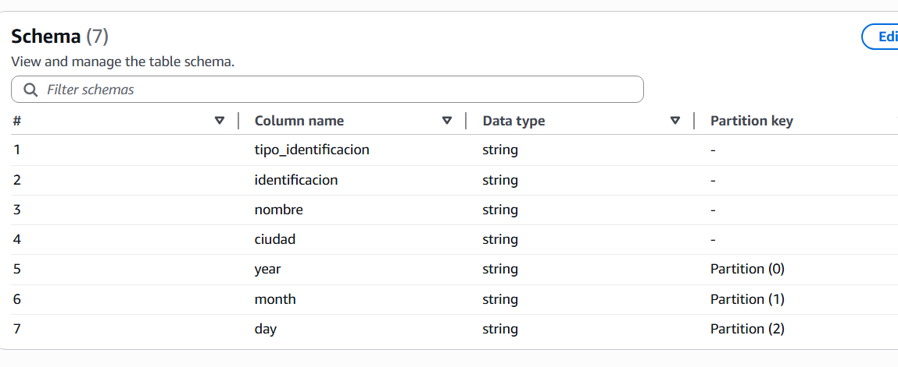
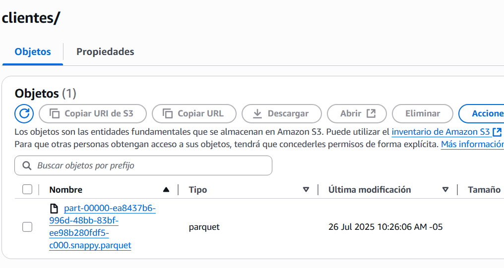

# prueba técnica de amaris consulting

## Ejercicio 1

## PUNTO 1

### 1. Creación de bucket

Se hace la creación del buket para la solución 
* - datalake-energy-company-camilo para el datalake
* - source-energy-company-camilo para la administración y recepción de archivos CSV

se propone la siguiente estructura 
* --raw/
* ---clientes/
* ----year=2025/
* -----month=07/
* ------day=25/
* ---proveedores/
* ----year=2025/
* -----month=07/
* ------day=25/
* ---transacciones/
* ----year=2025/
* -----month=07/
* ------day=25/

### 2. creación de Roles
se crean dos roles

* - Glue-Role-Amaris
para el uso de glue con los permisoso sobre AWSGlueServiceRole y AmazonS3FullAccess

* - Lambda-Role-Amaris
para la configuración de las lambdas con los permisos sobre AWSLambdaBasicExecutionRole y AmazonS3FullAccess

* - para el uso de ATHENA se crea el usuario camilo con los permisos sobre AmazonAthenaFullAccess y AWSGlueConsoleFullAccess

### 3. creación de Bases de datos
para la estrategía se proponen dos bases de datos, una para datos raw (energy_raw_db) y otro para datos procesados (energy_processed_db)

Al final la estructura la estratégia permite realizar el particionamiento por la fecha de carga

## PUNTO 2
Se crean 3 jobs de ejemplo de transformación de datos, se guardan en formato parquet en la bd energy_processed_db

* Clientes-procesados https://github.com/camilocero01/amaris/tree/main/procesamiento_clientes
* transacciones-procesadas https://github.com/camilocero01/amaris/tree/main/transacciones-procesadas
* Procesamiento_proveedor https://github.com/camilocero01/amaris/tree/main/Procesamiento_proveedor

Se deja ejemplo del resultado final con la data procesada en archivos parquet

## PUNTO 3
Se hace la  creación de crawler para automatizar y procesar los datos
Se crean dos crawler, uno para los datos raw (energy-raw-crawler-v2) y otro para los datos procesados (energy-raw-crawler-v2)

También se crea lambda energy-data-ingestion se deja código de la función https://github.com/camilocero01/amaris/blob/main/lambda_function.py

## PUNTO 4
PENDIENTEE

## PUNTO ADICIONAL 1 CREACIÓN DE IAC

Se usa CloudFormation, se realiza análisis y se genera IaC https://github.com/camilocero01/amaris/blob/main/Plantilla-amaris-template-1753560571699.yaml

# Ejercicio 2

PENDIENTE

# Ejercicio 3

## Pregunta 1
¿Qué experiencias has tenido como ingeniero de datos en AWS? ¿Cuál ha sido el proyecto más retador y por qué?

He trabajado en un sin fin de proyectos con empresas grandes, donde más que especilizarme en una nube, he tenido el reto de tener que adaptarme a las herramientas disponbilizadas por el proyecto, para ingenieria de datos he pasado por ambientes como GCP, AZURE, IIS, Informatica power center, tableau, power BI(estos dos últimos no son para ingenieria de datos pero hay clientes que si le dan eses uso ) 

Mi unica experiencia en AWS fue el desarrollo de dos ENDPOINTS en AWS usando API REST en ambiente NODE JS 

Mi experiencia ha sido más en nube azure con Azure Databricks, Azure Datafactory, Azure Synapse ,Spark y Python
En ambiente GCP usando dataprep, Bigquery y Bigquery ML para entregar un modelo de marketing RFM
En amazon es la única nube que no he tenido experiencia implementando, pero realizando la prueba téncica de Amaris, reafirmo mi teoria de que en todas las nubes existe un análogo de las diferentes herramientas presentadas en cada nube, aunque no tengo experiencia en AWS logré contruir en AWS un pipeline completo sin ningún inconveniente.

## Pregunta 2
¿Que estrategias has aplicado para crear los recursos necesarios en AWS para mantener una arquitectura y pipelines de datos?
Mi experiencia ha sido en visualización, gobierno de datos y en mis últimos 3 años mas como ingeniero de datos, la mayoria de las veces he llegado a proyectos donde los ambientes ya estan desplegados y me he dedicado casi exclusivamente que a desarrollar los scripts en python(este es mi gran fuerte), desafortunadamente no he tenido la experienca a fondo en desplegar y mantener una arquitectura en nube.

## Pregunta 3
¿Qué consideraciones tomarías al decidir entre almacenar datos en Amazon S3, RDS o Redshift?
En los contactos que he tenido con el ambientes de nube, siempre presentan varias soluciones para almacenamiento de datos pero se debe tener en cuenta varios factores:
* **Volumen**: algunos casi ilimitados mientras que otros con limites
* **Costos**: algunos con costos bajos y otros con costos altos
* **Uso:** algunos estan optimizados para almacenamientos, otros para transacciones y otros para procesamientos

Inventigando un poco se recomienda:
* s3 como solución más economica mas enfocada a datos brutos y como ambiente de limpieza y preparación de datos, recomendada para almacenamiento de archivos brutos o procesados pero en tipo archivo, no recomendado para hacer analítica avanzada
* RDS como solución con costos medio, enfocado a datos transaccionales,  recomendada para transacciones frecuentas y mayor rendimiento para transaccionalidad
* Redshift: solución que puede ser más costosa, enfocada para data lista para análisis de datos, usado más para consultas analíticas

## Pregunta 4
¿Qué beneficios y desventajas ves al utilizar AWS Glue en comparación con Lambda o Step Functions para orquestación ETL?

**AWS Glue Ventjas:**
* Es serverless
* Escalamiento automático
* Fácil integración entre s3, RDS y redshift
* Manejo de bigdata

**AWS Glue desventajas:**
* Al ser serverless, el arranque es frio, siendo lento para iniciar
* Limitaciones en lenguajes de programación (python y escala)
* Menos control y dificil debug 
* Al estar optmizado para bigdata no es usable para tareas pequeñas

**Lambda Ventjas:**
* Cualquier lenguaje de programación
* Arranque rápido
* Integración amplia por triggers
* Más facil de debugger al poderse integrar con herramientas de desarrollo

**Lambda desventajas:**
* Limitado en recursos como topes en memoria y en tiempos máximo de ejecución
* Todo lo opuesto a glue, al no esta optimizado para bigdata, funciona mejor con ejecuciones cortas de pocos datos o en tiempo real.

**Step Functions Ventjas:**
* Orquestación visual
* Alta tolerancia a fallos
* Integración nativa con servicios de AWS
* Auditoria completa

**Step Functions desventajas:**
* No procesa datos directamente, depende de otros servicios para procesar
* Complejo de configurar
* Puede aumentar los costos

e