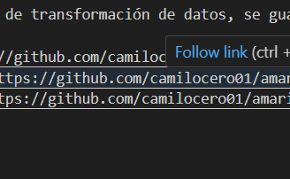

# prueba técnica de amaris consulting

## Ejercicio 1

## PUNTO 1

### 1. Creación de bucket

Se hace la creación del buket para la solución 
- datalake-energy-company-camilo para el datalake
- source-energy-company-camilo para la administración y recepción de archivos CSV

se propone la siguiente estructura 
--raw/
---clientes/
----year=2025/
-----month=07/
------day=25/
---proveedores/
----year=2025/
-----month=07/
------day=25/
---transacciones/
----year=2025/
-----month=07/
------day=25/

### 2. creación de Roles
se crean dos roles

- Glue-Role-Amaris
para el uso de glue con los permisoso sobre AWSGlueServiceRole y AmazonS3FullAccess

- Lambda-Role-Amaris
para la configuración de las lambdas con los permisos sobre AWSLambdaBasicExecutionRole y AmazonS3FullAccess

- para el uso de ATHENA se crea el usuario camilo con los permisos sobre AmazonAthenaFullAccess y AWSGlueConsoleFullAccess

### 3. creación de Bases de datos
para la estrategía se proponen dos bases de datos, una para datos raw (energy_raw_db) y otro para datos procesados (energy_processed_db)

## PUNTO 2
Se crean 3 jobs de ejemplo de transformación de datos, se guardan en formato parket en la bd energy_processed_db

Clientes-procesados https://github.com/camilocero01/amaris/tree/main/procesamiento_clientes
transacciones-procesadas https://github.com/camilocero01/amaris/tree/main/transacciones-procesadas
Procesamiento_proveedor https://github.com/camilocero01/amaris/tree/main/Procesamiento_proveedor

## PUNTO 3
Se hace la  creación de crawler para automatizar y procesar los datos
Se crean dos crawler, uno para los datos raw (energy-raw-crawler-v2) y otro para los datos procesados (energy-raw-crawler-v2)

También se crea lambda energy-data-ingestion se deja código de la función https://github.com/camilocero01/amaris/blob/main/lambda_function.py

 

